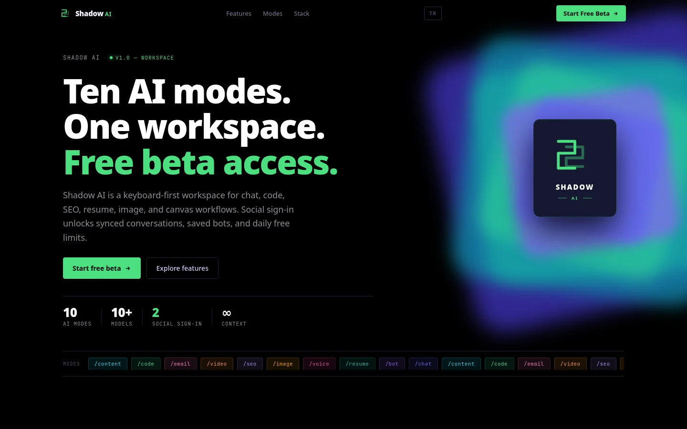
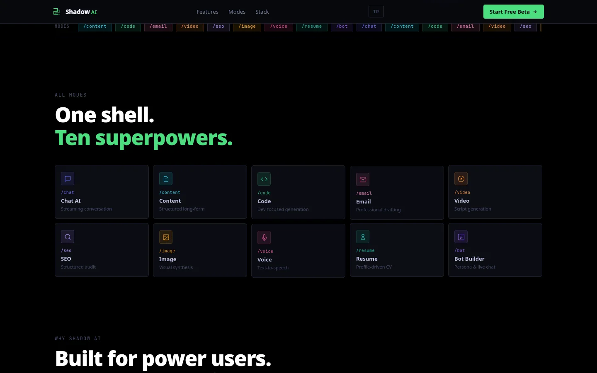
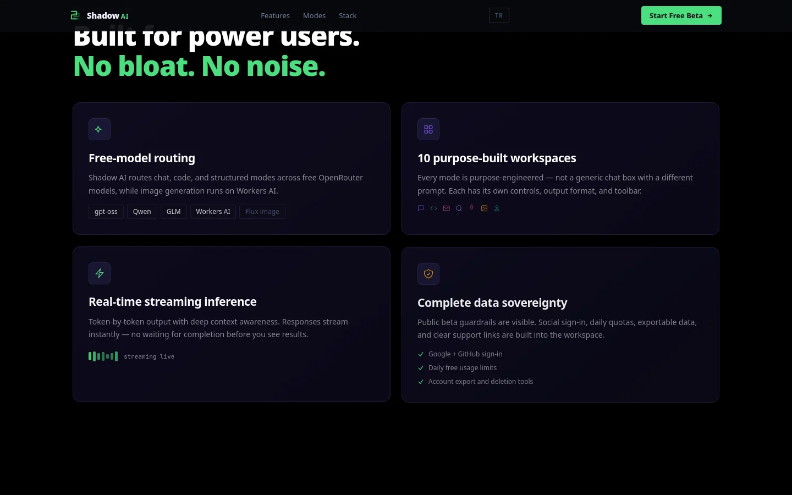
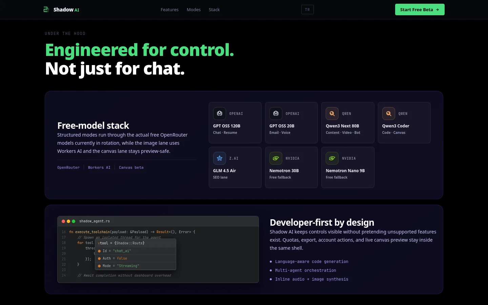
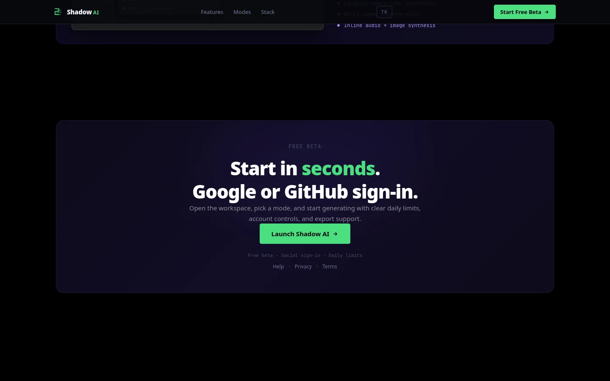
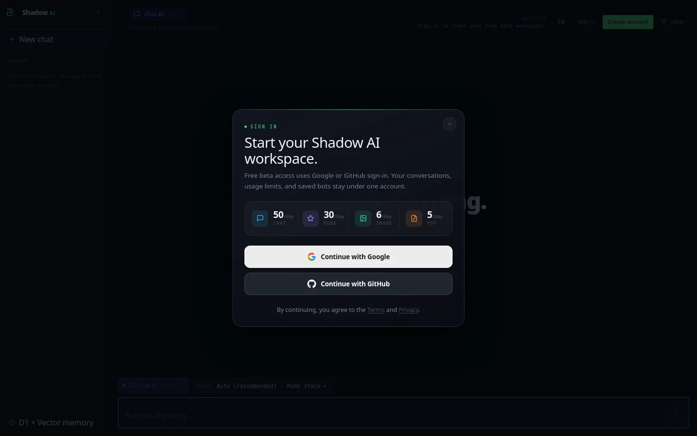
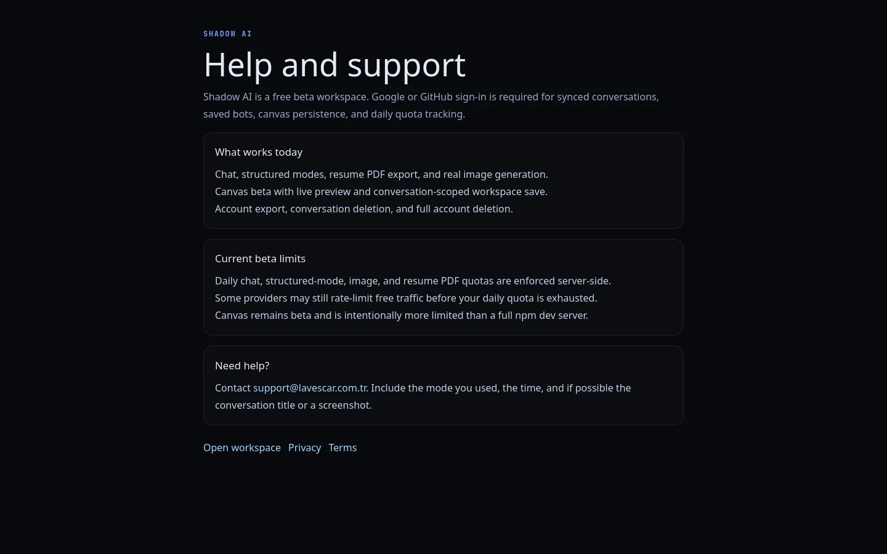
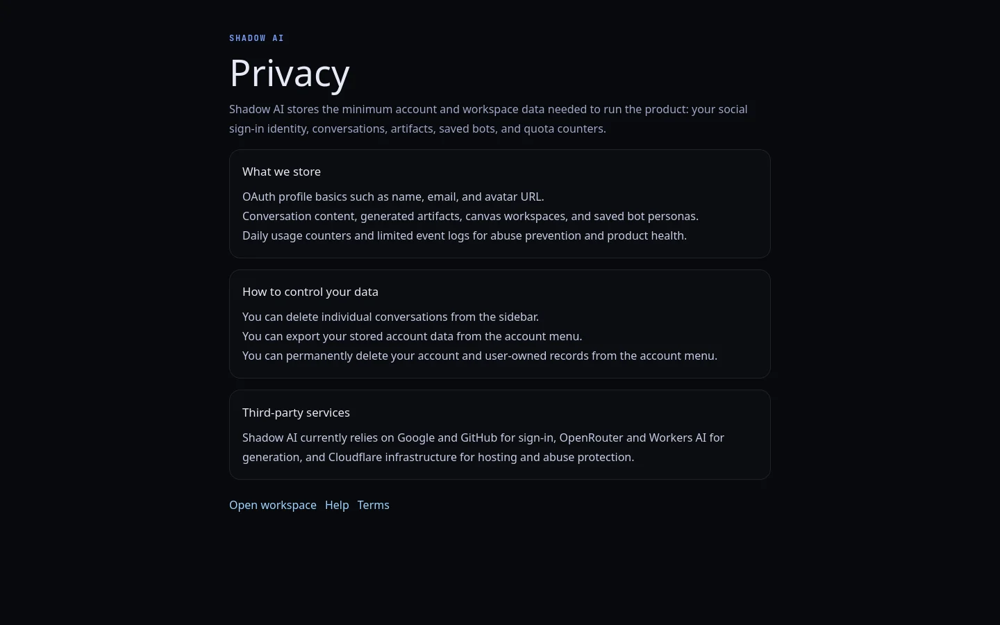

<div align="center">


# Shadow AI

**Cloudflare-hosted AI workspace — chat, code, SEO, resume, image, voice, and saved bot personas with synced conversations and memory recall.**

[](#tech-stack)
[](https://pages.cloudflare.com/)
[](https://lavescar.com.tr)
[](LICENSE)

[**▸ Live demo**](https://lavescar.com.tr) · [**▸ Portfolio**](https://lavescar.com.tr) · [**▸ Other demos**](https://lavescar.com.tr/#projects)

</div>

---

<p align="center"></p>

## Overview

Shadow AI is a multi-mode AI workspace running entirely on the Cloudflare edge. The Qwik frontend hands off to a separate Worker for OAuth, sessions, OpenRouter streaming, structured artifact generation, and Vectorize-backed memory recall. Conversations, bot personas, and per-mode artifacts persist in D1 so a user's history follows them across devices.

The demo doubles as a reference for shipping a "thin frontend, thick worker" architecture on Cloudflare's free tier with strict per-mode model routing through OpenRouter's free models.

## Features

- **Modes** — chat · code · content · email · video script · SEO · image-prompt · voice · resume · bot builder, each with its own artifact schema
- **Streaming chat** — Server-sent OpenRouter completions through `/api/chat/stream`, with optional saved bot persona injection
- **Memory** — D1 summary/fact/preference rows + Cloudflare Vectorize recall via `MEMORY_INDEX` (cosine, 384 dim)
- **Auth** — Google + GitHub OAuth, HttpOnly session cookies
- **Resume export** — Worker renders Unicode-capable PDFs (ATS-professional + modern visual templates) using Inter
- **Bot personas** — saved, reusable system-prompt presets selectable in chat mode
- **Free-tier first** — every default model is an OpenRouter `:free` route; per-mode model overrides via env vars

## Tech stack

| Layer | Technology |
|---|---|
| Frontend | Qwik City + Vite, statically generated |
| API | Cloudflare Worker (`worker/`), `/api/*` |
| Auth | Google + GitHub OAuth, HttpOnly cookies |
| DB | Cloudflare D1 (`nexus_ai`) |
| Memory | Cloudflare Vectorize (`MEMORY_INDEX`, 384d cosine) |
| AI | OpenRouter (free model chain) + Workers AI binding |
| Storage | Resume PDFs rendered server-side |
| Deploy | Cloudflare Pages + Workers |

## Screenshots

<table>
  <tr>
    <td></td>
    <td></td>
  </tr>
  <tr>
    <td></td>
    <td></td>
  </tr>
  <tr>
    <td></td>
    <td></td>
  </tr>
  <tr>
    <td colspan="2"></td>
  </tr>
</table>

## Quickstart

```bash
git clone https://github.com/Lavescar-dev/shadow-ai.git
cd shadow-ai
npm install

# Apply local D1 migrations
npm run db:migrate:local

# Frontend (Vite) on :5173
npm run dev

# Worker (Wrangler) on :8787 — separate terminal
npm run worker:dev
```

For cross-port local development the frontend reads `VITE_API_BASE_URL`:

```bash
VITE_API_BASE_URL=http://127.0.0.1:8787 npm run dev
```

## API surface

| Method | Path | Purpose |
|---|---|---|
| `GET` | `/api/me` | Current session user |
| `GET` `POST` | `/api/conversations` | List or create conversations |
| `GET` | `/api/conversations/:id/messages` | Persisted messages + artifact metadata |
| `POST` | `/api/chat/stream` | Streaming chat (optional `botId`) |
| `POST` | `/api/modes/run` | Run a non-chat mode, persist artifact |
| `GET` `POST` | `/api/bots` | List or create bot personas |
| `PATCH` `DELETE` | `/api/bots/:id` | Update or soft-delete a persona |
| `POST` | `/api/resume/pdf` | Render resume artifact as PDF |

## Architecture

```
┌────────────────┐  HTTPS  ┌──────────────────┐  D1   ┌──────────────┐
│  Qwik Pages    │────────▶│ Cloudflare Worker│──────▶│  nexus_ai    │
│  (static)      │ /api/*  │ auth · routes    │       │  conversations,│
└────────────────┘         │ OpenRouter proxy │       │  memory, bots │
                           │ Vectorize recall │       └──────────────┘
                           └──────────────────┘
                                    │
                          OpenRouter (free chain)
```

## Deploy

Production deploy notes, OAuth setup steps, Vectorize binding, and per-mode model overrides are in [`docs/DEPLOY.md`](docs/DEPLOY.md). Quick path:

```bash
npm run deploy:all
```

## License

MIT © 2026 Lavescar

---

<sub>Built by **[Lavescar](https://lavescar.com.tr)** · [Portfolio](https://lavescar.com.tr/#projects) · [efe@lavescar.com.tr](mailto:efe@lavescar.com.tr)</sub>
